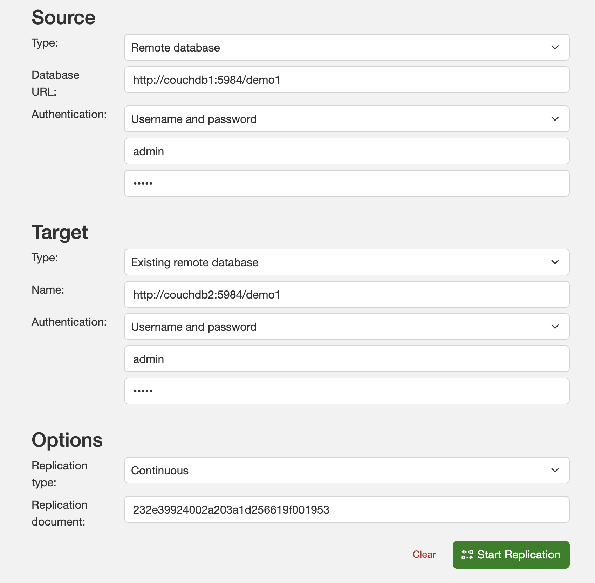
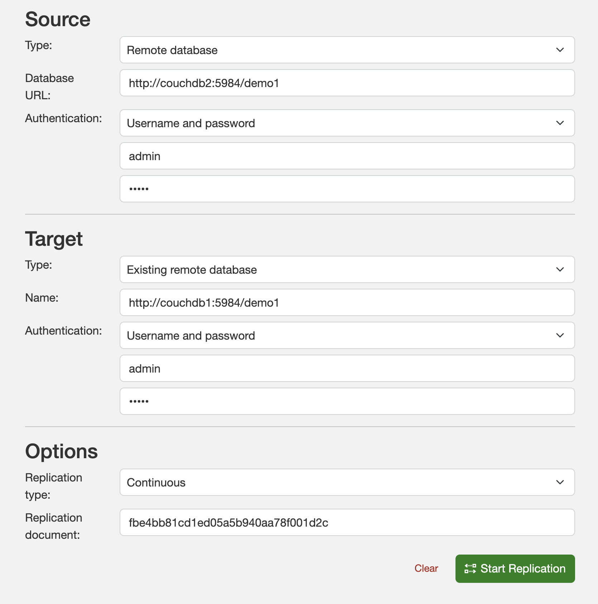

# Multi leader replication demo on CouchDB

This repo contains a docker file that runs a couple of couchDB containers. Both will be setup as multi leaders who can take their own writes. Each leader will then propagate the write to the other leader.

Follow the steps below to setup multi-leader replication and experiment with it.

## 1. Run docker containers

```
docker compose up -d
```

## 2. Access Fauxton UI for both CouchDB nodes

- http://localhost:5984/\_utils/
- http://localhost:5985/\_utils/

## 3. Create database "demo" in both nodes in Fauxton UI

## 4. Setup replication for database "demo" in couchdb1



## 5. Setup replication for database "demo" in couchdb2



## 6: Create docs in any database now and see them replicated automatically in the other couchDB node.

Both nodes are replicas of each other now!

Hope you found this demo helpful!
